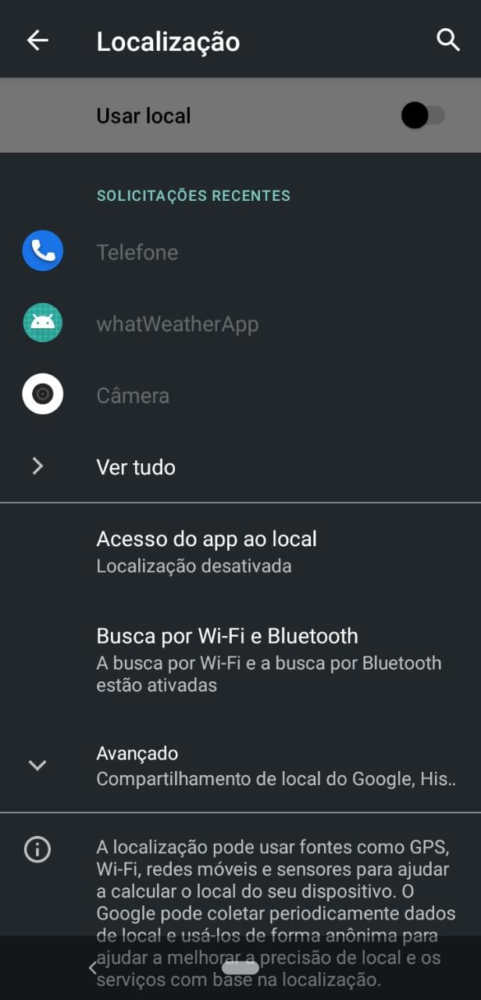

# whatWheaterApp
App desenvolvido com React Native, biblioteca [react-geocode](https://github.com/shukerullah/react-geocode) e API's de consumo [Google Maps Geocoding](https://developers.google.com/maps/documentation/geocoding/overview) e do clima com [openWeatherMap](https://openweathermap.org).

# Instalação
Após instalar as dependencias para rodar projetos React-Native (Node, SDK java, @react-native-community/cli), entre na pasta do projeto pelo Terminal e executa o comando: yarn android ou npx react-native run-android.

# Como funciona
Este aplicativo captura a localização atual do usuário e exibe na tela seu endereço e dados climáticos da região.
Necessita da internet e do GPS do dispositivo habilitado, é recomendado que seja emulado em um dispositivo físico.
Se mesmo depois de habilitado a internet e GPS não mostrar dados, feche o aplicativo e abra novamente.

# Screenshots

